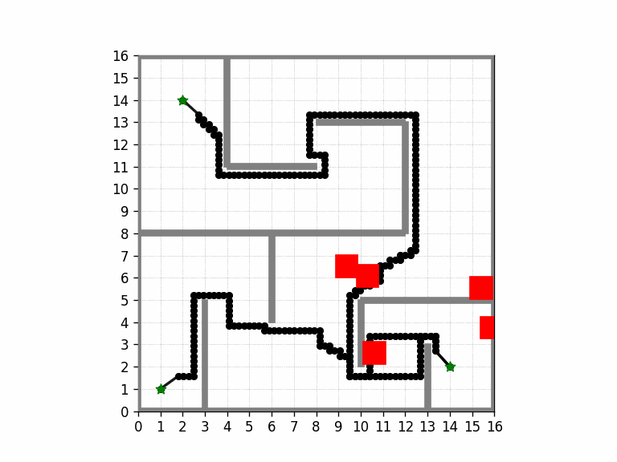

# pdm_group_project - PDM Group 3 repository

This repository contains all the code used for group 3's final project for Planning and Decision Making (RO470005) course. While most of the code is developed by us, we have a significant amount of the original `gym-pybullet-drones` repository, used for simulation and for enviroment tools. 



## Installation

Tested on Intel x64/Ubuntu 22.04

TODO - we need to change this based on how we submit the code and check for more packages we used

```sh
git clone https://github.com/utiasDSL/gym-pybullet-drones.git
cd pdm_group_project/

conda create -n drones python=3.10
conda activate drones

pip3 install --upgrade pip
pip3 install -e . # if needed, `sudo apt install build-essential` to install `gcc` and build `pybullet`

# check installed packages with `conda list`, deactivate with `conda deactivate`, remove with `conda remove -n drones --all`
```

## Use

### 2D Vizualization

To run our custom 2D vizualization tool, run the command below

```sh
cd ./Task_2D/
python3 interactive.py # uses all default arguments
```

**Note:** To continue see the next of state of the vizualition, close the existing the figure which is opened automatically. 

### Arguments 

These are all the possible arguments that the the interactive script can handle

| Argument | Type | Default | Description |
| --- | --- | ---| ---- |
| `--environment`      | `str` | `"medium"` | Environment complexity. Options: `easy`, `medium`, `difficult`                           |
| `--obstacle_density` | `str` | `"sparse"` | Density of obstacles unknown to the global planner. Options: `none`, `sparse`, `crowded` |
| `--graph_creator`    | `str` | `"Grid"`   | Method used to construct the global planning graph. Options: `Grid`, `PRM`               |
| `--search_algorithm` | `str` | `"aStar"`  | Graph search algorithm. Options: `aStar`, `Dijkstra`                                     |
| `--local_planner`    | `str` | `"MPPI"`   | Local motion controller. Options: `PID`, `MPPI`                                          |
| `--max_nodes`        | `int` | `1000`     | Maximum number of nodes used by the global planner                                       |
| `--horizon`          | `int` | `25`       | MPPI horizon, to improve obstacle avoidance                                              |
| `--rollouts`         | `int` | `200`      | MPPI rollouts, to improve obstacle avoidance                                             |
| `--seed`             | `int` | `42`       | Random seed for reproducibility                                                          |

### More Examples

Below are a few more examples we found insightful. If not specified, the default parameters from above are used.

<code>easy</code> enviroment, using <code>Dijkstra</code>. 

    python interactive.py --environment easy --search_algorithm Dijkstra

<code>medium</code> enviroment with <code>none</code> obstacles, using <code>Grid</code> and <code>PID</code>. 

    python interactive.py --obstacle_density none --graph_creator Grid --local_planner PID

<code>medium</code> enviroment with <code>none</code> obstacles, using the default <code>PRM</code> and <code>MPPI</code>, but increasing to <code>2500</code> nodes

    python interactive.py --obstacle_density none --max_nodes 2500

<code>difficult</code> enviroment with <code>crowded</code> obstacles, with <code>PID</code>, increasing to <code>2500</code> nodes, and a set seed of <code>10</code> (PID Fail)

    python interactive.py --environment difficult --obstacle_density crowded --local_planner PID --seed 10 --max_nodes 2500

The same conditions as above but with more nodes and <code>MPPI</code> instead (MPPI Sucess)

    python interactive.py --environment difficult --obstacle_density crowded --seed 10 --max_nodes 4000 --horizon 40

The same conditions as above but with a different seed and smaller horizon (MPPI Fail)

    python interactive.py --environment difficult --obstacle_density crowded --seed 8 --max_nodes 4000 --horizon 25

### PID control on 3D Simulation (Pybullet Integration)

```sh
cd ./Task_2D/
python3 sim_3d.py
```

Unfortunaly we we're not able to integrate our MPPI solution with the PyBullet simulator within the short deadline provided. 

## Package Descriptions

Asides from the gymPyBullet for simulation, all the code used in the project was built from scratch using basic python libraries (numpy, matplotlib, etc).

<code>prm/</code> contains the code for the roadmap construction; How we represent the graph with nodes (node.py), how to construct it with the Probabilistic Roadmap algorithm (prm_algorithm_v2.py) and the Sukharev grid (grid_graph.py).

<code> mppi_2d/</code>  and <code>mppi_3d/</code> provides a Model Predictive Path Integral (MPPI) controller for trajectory tracking and obstacle avoidance using stochastic rollouts. It includes planning, execution with quadrotor dynamics, and comprehensive evaluation and visualization utilities.

<code>aStar/</code> implements graph-based global path planning using A* and Dijkstra algorithms over probabilistic (PRM) or grid-based environments. The package includes graph construction, collision-aware shortest-path search, and visualization utilities for static obstacle environments.

<code>enviromentBuilder/</code> implements a way to build the custom enviroments, randomize obstacles, determine if a certain configuration is within collision and determine which parts of the code has acess to what parts of the enviroment.

<code>Task_2D/</code> contains a wrapper for integrating the different algorithms in a pipeline (task_wrapper.py) and a script to test different scenarios and algorithms (interactive.py). In Task_2D are also scripts for automatically running multiple experiments, store the results as .npz files and load these files in for data visualization.

<code>Task_3D</code>  contains the interface to test our code with the simulator.

<code>visualization</code> contains the the code for vizualizing the results in planar and 3d world. 

<code>gym_pybullet_drones</code> this package contains code from the original repository for the simulator. in the subfolder prm_pid_control we implement code for integrating our code with the simulator.

## References

- Jacopo Panerati and Hehui Zheng and SiQi Zhou and James Xu and Amanda Prorok and Angela P. Schoellig (2021) [*Learning to Fly---a Gym Environment with PyBullet Physics for Reinforcement Learning of Multi-agent Quadcopter Control*](https://github.com/utiasDSL/gym-pybullet-drones)


## Troubleshooting

- On Ubuntu, with an NVIDIA card, if you receive a "Failed to create and OpenGL context" message, launch `nvidia-settings` and under "PRIME Profiles" select "NVIDIA (Performance Mode)", reboot and try again.
-->
